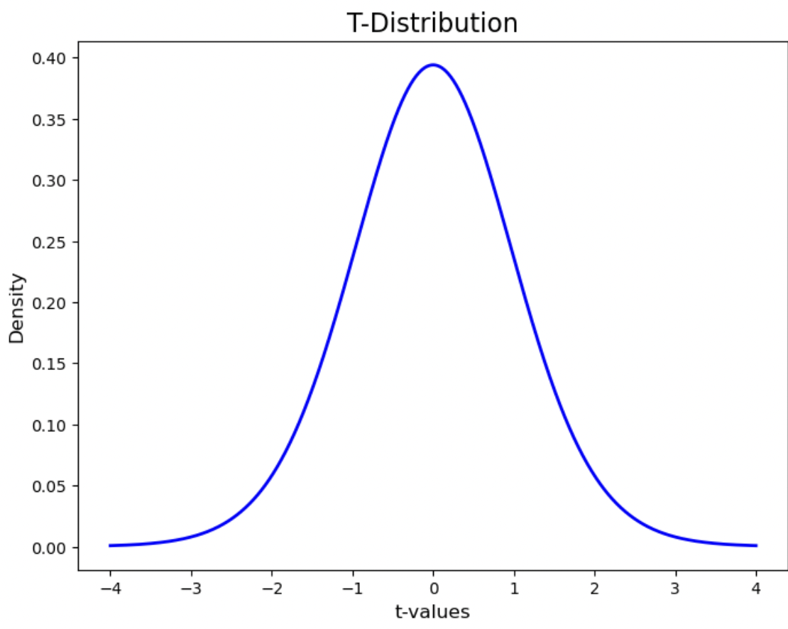
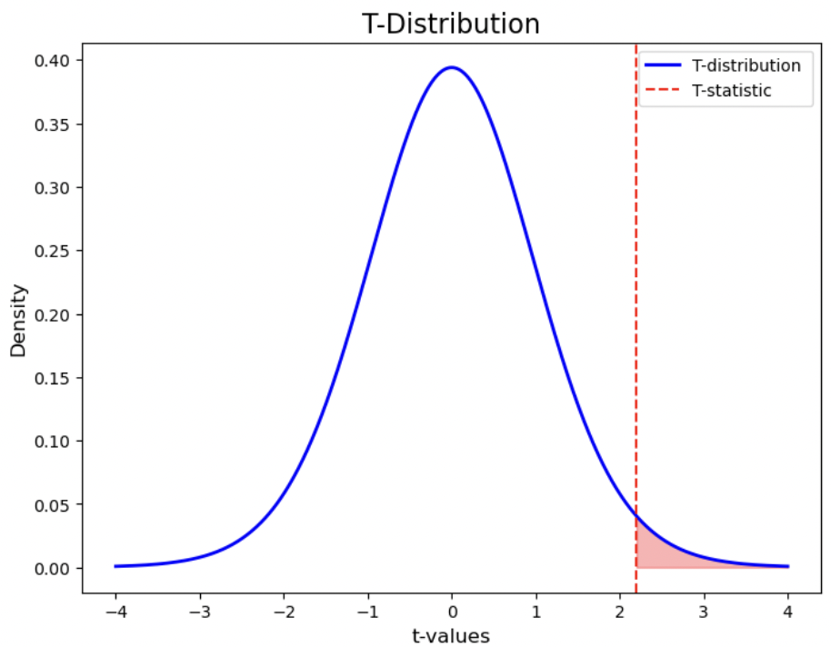
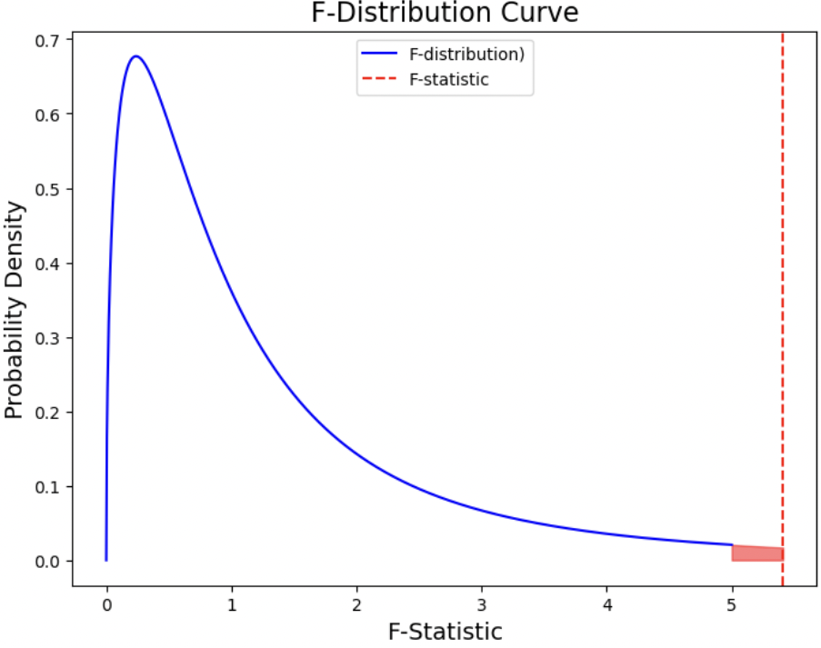
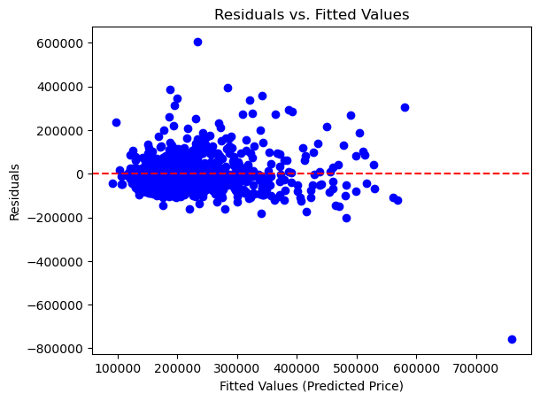
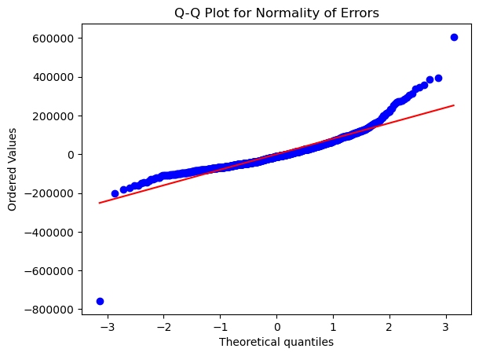

# Statistical Inference II
```console
Data Sciences Institute
Linear Regression, Classification, and Resampling
```

---
##### Learning objectives
- Define and interpret null and alternative hypotheses for linear regression.
- Differentiate between the t-test (for individual coefficients) and the F-test (for overall model fit).
- Perform hypothesis testing in Python to evaluate the significance of individual regression beta coefficients (including intercept) and assess the overall fit.

---
#### Hypothesis testing
- Hypothesis testing is a method used to make decisions or inferences about a population based on sample data.
- It helps determine if the observed data provides enough evidence to support a specific claim or reject it.
- For example, *is there a relationship between two variables?*
  - Between the size of a house in Sacramento and its sale price

---
#### Null and Alternative Hypotheses
- When conducting statistical inference, we evaluate two competing hypotheses:
  
  1. Null Hypothesis ($H_0$): The hypothesis we formally test. It typically represents "no effect" or "no difference". The null hypothesis is what we assume to be true.  
  2. Alternative Hypothesis ($H_1$): The hypothesis that is contradictory to $H_0$ and of particular interest in our research. 

- **Important**: We cannot prove any hypothesis ($H_0$ or $H_1$) is **true**. Instead:

  1.  If our data is inconsistent with the null hypothesis ($H_0$), we reject $H_0$ in favor of the alternative hypothesis ($H_1$). However, this does not imply that $H_1$ is true; rather, it indicates that we have evidence against $H_0$.
  2.  If our data is consistent with the null hypothesis ($H_0$), we cannot reject $H_0$. **This is not the same as accepting $H_0$.**
---

#### Recap of Linear Regression Equation
- The equation for the straight line in simple linear regression is:
  
  
$$
\text{y} \approx \beta_0 + \beta_1 \text{x}
$$

  where:
  
  $\text{y}$ is the response variable.
  
  $\beta_0$ is the vertical intercept.
  
  $\beta_1$ is the slope of the predictor
  
  $\text{x}$ is the predictor (e.g., house size)
  

- Finding the line of best fit involves determining coefficients $\beta_0$ and $\beta_1$ that define the line.

---
 ##### Example dataset
932 real estate transactions in Sacramento, California is the dataset we will be using, specifically for predicting whether the size of a house in Sacramento can be used to predict its sale price. 

- *Key features:* 
  - 932 observations (rows)
  - predictor of interest (sqft; house size, in livable square feet)
  - response variable of interest (house sale price, in USD)
---

#### Hypothesis test for coefficients
One question we may ask: *Is there a relationship between the size of the house and the house price?*
We can address this question by testing whether the regression coefficient $\beta_1$ is sufficiently far enough from $0$.

- $H_0: \beta_1 = 0$ meaning there is no relationship between house size and the price 
  
- $H_1: \beta_1 \neq 0$ meaning there is a relationship between the house size and price

Essentially, we have 2 competing hypotheses: 
-  $H_0 : \beta_1 = 0$ vs. $H_1 : \beta_1 \neq 0$


---
#### Hypothesis test for coefficients when predictors are categorical 

*Note.* When using categorical predictors in a regression model, the interpretation of coefficients differs from that of continuous predictors. 
- Here, $\beta$ coefficients tell us the impact of each category (relative to the reference category) on the outcome.
- This is done by testing if the $\beta$ coefficients for the categories are significantly different from zero.
---
Let's assume we have a regression model where house type (Residential, Condo, Multi-Family) is our predictor variable and house price is the outcome variable.
- Residential (our reference category) will not have a coefficient because it’s the baseline.
- Condo and Multi-Family will have their own coefficients.
- For example, we have:
  - $\beta_0$: Intercept (average house price for Residential). This represents the average house price for the Residential category (since it is the reference group).
  - $\beta_1$: Coefficient for Condo. This represents how much the average house price for a Condo differs from the Residential group.
  - $\beta_2$: Coefficient for Multi-Family. This represents how much the average house price for a Multi-Family house differs from the Residential group.
---

#### Hypothesis test for coefficients
In order to test the null hypothesis, we need to determine whether $\beta_1$ is sufficiently *far* enough from $0$.

To test this, we use the **t-statistic**
$$t = \frac{\hat{\beta_1} - 0}{SE(\hat{\beta_1})}$$

- $\hat{\beta_1}$: Estimated coefficient for the predictor
- $SE(\hat{\beta_1})$: Standard error of the estimated coefficient
- $0$: The value under the null hypothesis (*recall* $H_0 : \beta_1 = 0$)
- **Note:** The hat represents our estimate of the parameter
---
#### What Does "Sufficiently Far from 0" Mean?

- Here, $0$ represents the value under the null hypothesis
- The $\text{t}$ statisic measures how *far* $\beta_1$ is from $0$, expressed in terms of standard errors:
  - Large $|\text{t}|$: $\beta_1$ is far from $0$. Evidence against $H_0$
  - Small $|\text{t}|$: $\beta_1$ is close to $0$. Data are consistent with $H_0$
- The exact threshold for what is considered "far" enough depends on the **sample size**  and the **significance level $\alpha$** of the test (typically set to $0.05$).
  - we compare $|\text{t}|$ to the critical value corresponding to these levels of significance (this critical value is calculated under the t-distribution table, dependent on our sample size)

---
#### What is the t-distribution?
- The t-distribution is a type of curve used in statistics, just like the bell-shaped 🔔 normal distribution.
- The t-distribution helps determine how "far" from zero is sufficiently far to reject the null hypothesis.
- By comparing $t$ to critical values from the t-distribution, we can determine whether the beta coefficient is likely due to chance or if there is a statistically significant relationship between the predictor and the outcome.

---

- The t-distribution is used to determine if the t-statistic ($t$) is large enough to reject the null hypothesis.
- The red dashed line represents the $t$ value calculated for the estimated beta coefficient.
- The area shaded in red represents the rejection region, where we would reject the null hypothesis if our t-statistic lies there.

---
#### Multivariable linear regression
- We can extend our model to include multiple predictors! Each predictor variable *may* give us new information to help create our model. 
- For example, let's say we now want to include both house size and number of bedrooms as predictors in our model

$$
\text{y} = \beta_0 + \beta_1(x_1) + \beta_2(x_2)
$$

  where:
  $\text{y}$ is the response variable.
  $\beta_0$ is the vertical intercept.
  $\beta_1$ is the slope for predictor 1 (e.g., ($x_1$) house size)
  $\beta_2$ is the slope for predictor 2 (e.g., ($x_2$) number of bedrooms)


---
#### Hypothesis test for multiple coefficients
For multiple predictors, the process is the same! 
We perform separate t-tests for each $\beta$ coefficient to determine if it differs significantly from $0$.
1. Null Hypothesis ($H_0$): The predictor has no effect on the outcome.
2. Alternative Hypothesis ($H_1$): The hypothesis that is contradictory to $H_0$. The predictor has an effect on the outcome.

- $H_0 : \beta_1 = 0, \beta_2 = 0...$ 
- $H_1 : \beta_1 \neq 0, \beta_2 \neq 0...$ 

---
#### The F-Statistic for Testing Multiple Predictors in Linear Regression

- While the t-test is used to test significance of **individual** $\beta$ coefficients, the **F-statistic** is used to test the **overall signficance** of the regression model with multiple predictors.
- The F-statistic test tells us if the model *as a whole* is significantly better than a model with no predictors at all (intercept model only). 

---
#### Null and Alternative Hypotheses for the F-test

1. Null Hypothesis ($H_0$) : **ALL** predictors have no effect on the outcome
2. Alternative Hypothesis ($H_1$): At least **ONE** of the predictors significantly affect the outcome.  

- $H_0 : \beta_1 = 0, \beta_2 = 0...$ 
- $H_1 :$ At least one $\beta_i \neq 0$ 
---
#### How the F-test works
- The F-statistic is calculated by comparing two models:
  - A full model with the predictors in the regression.
    $$\text{y} = \beta_0 + \beta_1 x_1 + \beta_2 x_2 + \beta_3 x_3 $$
  - A reduced model with no predictors (just the intercept).
    $$\text{y} = \beta_0 $$

- The reduced model simply predicts the outcome using the mean of $y$, whereas the full model incorporates the predictors $x_1$, $x_2$, and $x_3$ to potentially explain the variance in $y$.
- The F-statistic tests if the full model significantly improves our ability to predict $y$ compared to the reduced model. 
---
#### How the F-test works

- It compares the explained variance in the full model to the unexplained variance.

  - Explained Variance: Variability in $y$ is explained by the predictors in the full model.
  - Unexplained Variance: Variability in $y$ that is not explained by the predictors, representing the error or residuals
    
  $$F = \frac{\text{Explained Variance}}{\text{Unexplained Variance}}$$

  - Large $\text{F}$: indicates the full model significantly improves the prediction of y compared to the reduced model. Evidence against $H_0$
  - Small $\text{F}$: indicates the model does not explain much more variance than just using the mean of $y$. Data are consistent with $H_0$

---

#### What Does "Sufficiently Large" Mean for F?


- The exact threshold for what is considered "large" depends on the **sample size** and the **significance level**, typically set to $0.05$.
  
- If the **F** exceeds the critical value from the **F-distribution** for the given significance level, we **reject the null hypothesis** (**$H_0$**) and conclude that the full model is a better fit for the data.

- In other words, a "large" F-statistic suggests that the model explains a significant amount of variance in **y**, beyond what would be expected by chance.

---
#### What is the F-distribution?
- The F-distribution is commonly used in statistics to compare how much better a full model fits the data compared to a simpler model.
- The F-distribution is **right-skewed**, meaning it has a long tail on the right side, and the value of F is always positive.


---
- We use the F-statistic, which is calculated from the model, to compare it against critical values from the F-distribution to decide whether the full model is a better fit for the data.


---
#### Key Assumptions in Linear Regression
You can test these assumptions **before** running the model

1. **Linearity**: There’s a straight-line relationship between the predictor ($X$) and response ($Y$) variables.
   - You can visually check by plotting the data ($X$ vs. $Y$) to see if the relationship appears to be roughly linear.

2. **Independence**: Data points should be independent of each other, meaning no correlation between errors from different observations.
   - This assumption is usually inherent in how the data is collected. 

3. **No or Little Multicollinearity**: In multiple regression, predictors shouldn’t be highly correlated with each other.
   - You can check using techniques like  Variance Inflation Factor (VIF)
---
#### Key Assumptions in Linear Regression
You can test these assumptions **after** running the model

4. **Homoscedasticity**: The spread of the errors should be constant across all values of ($X$). In other words, the error variation shouldn’t change as ($X$) changes.
   - After fitting the model, you can plot the residuals (errors) against the fitted values (predicted Y values). If the spread of residuals is constant, the assumption holds. 

5. **Normality of Errors**: The errors should be roughly normally distributed, especially for accurate hypothesis testing.
   - After fitting the model, you can use a Quantile-Quantile (Q-Q) plot to check if the residuals are approximately normally distributed. If the residuals deviate significantly from a straight line on the Q-Q plot, the assumption might be violated.

---
#### Residuals vs. Fitted Values Plot

- **Fitted Values:** Predicted values of $Y$ from the regression model.
- **Residuals:** Differences between actual values of $Y$ and the fitted values.

The horizontal line at zero shows where residuals should center. If the points are randomly scattered around it, homoscedasticity is met. A funnel shape suggests a violation of homoscedasticity.



---
#### Q-Q Plot 
A **Q-Q plot** checks if the residuals follow a normal distribution.

- **Straight line**: Residuals are approximately normal, satisfying the normality assumption.
- **Bend away from the line**: Residuals are skewed or have heavy tails, suggesting a violation of normality.

---
## `Putting it all together`
### `Statistical testing in Python`
